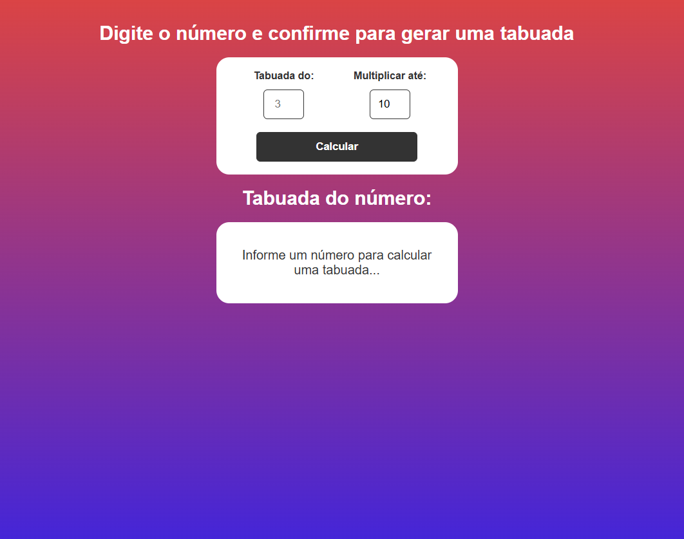
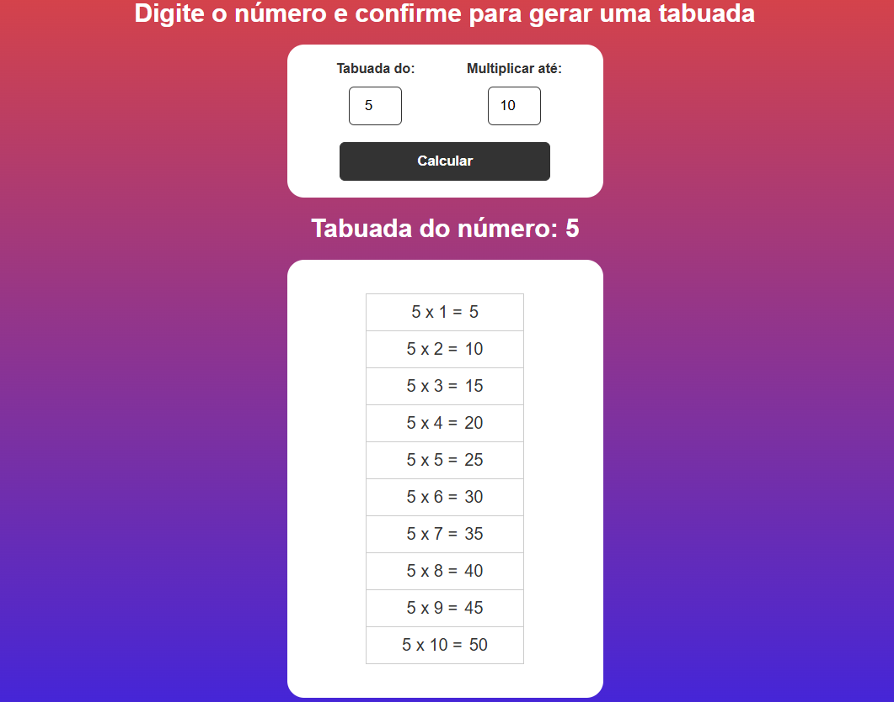

# 🧮 Tabuada JS

Este é um projeto simples de **Gerador de Tabuada (Multiplication Table Generator)** desenvolvido para praticar e consolidar conhecimentos em **HTML, CSS e JavaScript Vanilla**.

A aplicação permite que o usuário insira um número base e defina até qual número ele deve ser multiplicado, gerando a tabela de resultados dinamicamente na tela.

<div align="center">
   
  
  </div>

---

## 🚀 Tecnologias Utilizadas

O projeto foi construído apenas com tecnologias web fundamentais:

* **HTML5:** Estrutura básica e formulário de entrada.
* **CSS3:** Estilização responsiva e o fundo gradiente (`background: linear-gradient`).
* **JavaScript (Vanilla JS):** Lógica principal, manipulação do DOM e geração da tabuada.

---

## ⚙️ Como Usar (Instalação Local)

Para ver o projeto rodando em sua máquina, siga os passos abaixo:

### 1. Clonar o Repositório

Abra seu terminal e clone o repositório do GitHub:

## ⚙️ Como Usar (Instalação Local)

Para ver o projeto rodando em sua máquina, siga os passos abaixo:

### 1. Clonar e Navegar

Abra seu terminal, clone o repositório e navegue até a pasta:

```bash
# Clone o projeto
git clone [https://github.com/lucasdmrsilva/tabuada-js.git](https://github.com/lucasdmrsilva/tabuada-js.git)

# Acesse a pasta
cd tabuada-js
```
---

## 🤝 Contribuição e Contato

Sinta-se à vontade para explorar o código. Se tiver sugestões ou quiser relatar um problema, pode abrir uma **issue** no repositório.

*  **[LinkedIn Lucas Silva](https://www.linkedin.com/in/lucasmrsilva)**
*  **[E-mail Lucas Silva](mailto:lucasmrsilva1198@gmail.com)**
